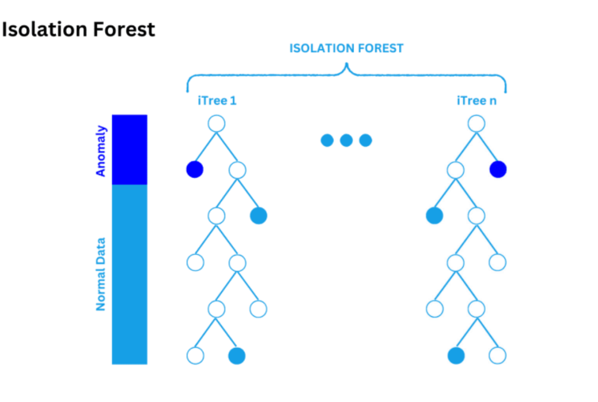
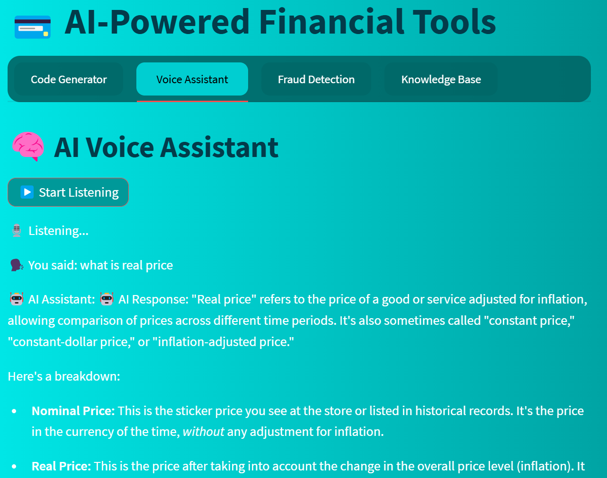
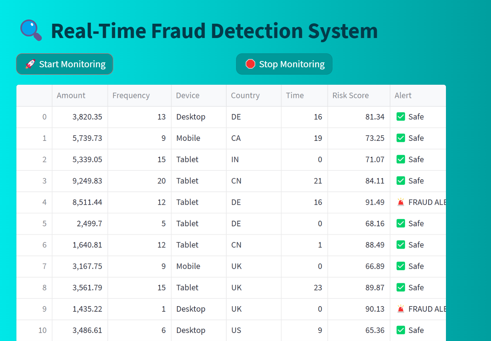
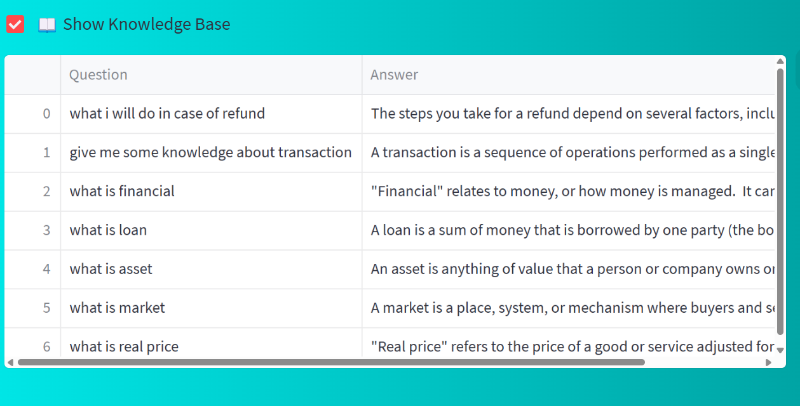

# 💳 PayCrypt AI-Powered Financial Tools

PayCrypt is an advanced Streamlit-based platform that brings the power of Artificial Intelligence to modern financial workflows. Designed for developers, fintech teams, and security analysts, it streamlines payment integration, assists users via voice, monitors transaction fraud in real time, and builds a self-improving knowledge base using generative AI.

Whether you're a developer needing instant payment integration code, a support agent looking for quick payment answers, or a fraud analyst monitoring transactions, PayCrypt provides an all-in-one, intelligent solution — right from your browser.

🔐 Built with a focus on security, scalability, and user-friendly design, this tool demonstrates how AI can enhance productivity, automation, and safety in financial systems.

---

## Features

- **AI Payment Integration Code Generator:**  
  Instantly generate payment gateway integration code for Stripe, PayPal, or Razorpay in Python, Node.js, or Java.

- **Voice Assistant:**  
  Use your microphone to ask payment-related questions and get answers from a knowledge base or Gemini LLM.

- **Real-Time Fraud Detection:**  
  Simulate and monitor transactions with anomaly detection (Isolation Forest), displaying risk scores and fraud alerts live.

- **Knowledge Base Automation:**  
  Ask questions and build a persistent, AI-augmented payment knowledge base.

---

## Tech Stack

- **Frontend:** Streamlit
- **AI/ML:** Google Gemini LLM, LangChain, Isolation Forest (scikit-learn)
- **Speech:** SpeechRecognition (Google Speech API)
- **Data:** Pandas, Numpy
- **Other:** JSON, MinMaxScaler, Random, Time

---

## Setup

1. **Clone the Repository**
```bash
 git clone https://github.com/AmanYadav000/PayCrypt.git
 cd PayCrypt
```
2. **Install Dependencies**
```bash
pip install streamlit google-generativeai speechrecognition pandas numpy scikit-learn langchain-google-genai
```
3. **Set Up Google Gemini API Key**
```bash
Get your Gemini API key from Google AI Studio.
Replace `"Your API Key"` in the code with your actual key.
```

4. **Run the App**
```bash
streamlit run Combined_final_code.py
```


---

## Usage

### 1. AI-Powered Payment Integration Code Generator

- Select a payment gateway and programming language.
- Optionally add custom instructions.
- Click **Generate Code** to get an AI-generated code snippet.

### 2. AI Voice Assistant

- Click **Start Listening** and speak your payment-related question.
- The assistant transcribes and answers using the knowledge base or Gemini LLM.

### 3. Real-Time Fraud Detection System

- Click **Start Monitoring** to simulate transactions.
- View each transaction's risk score and see fraud alerts in real time.
- Click **Stop Monitoring** to pause and see a summary of fraud alerts.



### 4. Payment Knowledge Base Automation

- Type your question and click **Get Answer**.
- The answer is fetched from the knowledge base or generated by Gemini, then saved for future use.
- Optionally, display the full knowledge base.

---

## Customization

- **Knowledge Base File:**  
The knowledge base is stored in `gemini_payment_knowledge_base.json` for persistence.

- **Synthetic Data:**  
Modify the `generate_synthetic_data` function to change transaction simulation parameters.

- **Fraud Detection Model:**  
Adjust Isolation Forest or replace with another model as needed.

- **UI Styling:**  
Custom CSS is injected via `st.markdown` for a modern look.

---

## Example Screenshots





---

## Security & Privacy

- API keys are required for Gemini LLM access.
- No sensitive data is stored or transmitted outside your environment unless you modify the code.

---

## License

MIT License

---

## Credits

- [Google Gemini](https://ai.google.dev/)
- [Streamlit](https://streamlit.io/)
- [scikit-learn](https://scikit-learn.org/)
- [SpeechRecognition](https://pypi.org/project/SpeechRecognition/)
- [LangChain](https://python.langchain.com/)

---
